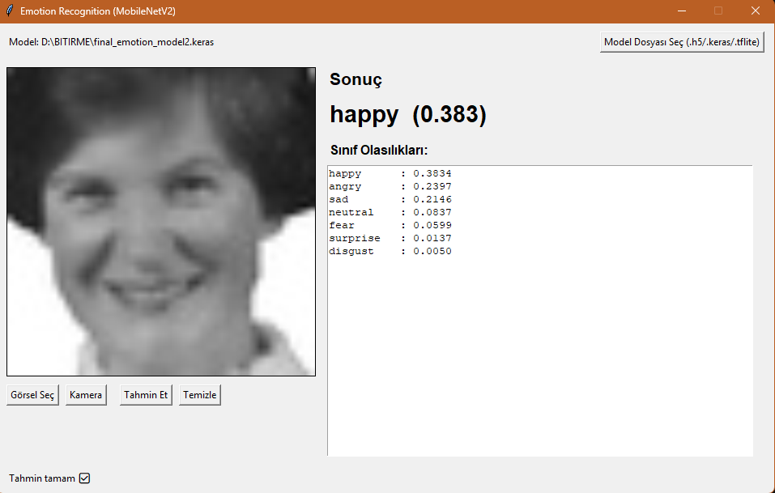

# Facial Emotion Recognition with MobileNetV2

<<<<<<< HEAD


English comes first. Turkish version is available below.

=======
>>>>>>> be90cbf1fdb1c16e4300f658662bcc6d9bae31d6
## Overview

This project focuses on **facial emotion recognition (FER)** using deep learning.  
The goal is to classify a face image into one of the following seven emotions:

- angry
- disgust
- fear
- happy
- neutral
- sad
- surprise

The final approach is based on **MobileNetV2** with transfer learning and was designed to be relatively lightweight and practical for demo usage.

## Project Highlights

- MobileNetV2 backbone pre-trained on ImageNet
- 7-class facial emotion classification
- Transfer learning and fine-tuning
- Class imbalance handling with `class_weight`
- Controlled oversampling for underrepresented classes
- Mixed precision training
- Gradient accumulation
- Tkinter-based desktop demo for image and camera input

## Final Model

The demo application currently uses:

- `final_emotion_model2.keras`

Note:
The graduation report mentions `final_emotion_model.keras` as the final artifact name, but the current demo script in this repository is configured to load `final_emotion_model2.keras`.

## Model Architecture

The final model is built on:

- `MobileNetV2(include_top=False, weights="imagenet")`
- `GlobalAveragePooling2D`
- `Dense(256, activation="relu", kernel_regularizer=L2)`
- `Dropout(0.4)`
- `Dense(7, activation="softmax")`

Input size:

- `224 x 224 x 3`

## Dataset and Training Strategy

According to the project report, the training pipeline was standardized into a `train / val / test` structure and the final training setup used:

- ImageDataGenerator-based loading
- Data augmentation
  - `rotation_range=10`
  - `width_shift_range=0.05`
  - `height_shift_range=0.05`
  - `horizontal_flip=True`
- `CategoricalCrossentropy(label_smoothing=0.07)`
- Balanced `class_weight`
- Controlled oversampling for the `disgust` class
- Mixed precision (`mixed_float16`)
- Gradient accumulation (`ACCUM_STEPS=2`)

The report also states that multiple datasets were used during experimentation and standardization, including:

- FER-2013
- JAFFE
- KDEF

## How the Dataset Was Built

The final dataset was created by combining and standardizing multiple facial expression datasets instead of using a single ready-made training folder.

Preparation workflow:

1. Raw datasets such as **FER-2013**, **JAFFE**, and **KDEF** were collected.
2. Emotion labels were mapped into a common 7-class taxonomy:
   - angry
   - disgust
   - fear
   - happy
   - neutral
   - sad
   - surprise
3. Different folder layouts and image formats were cleaned and standardized.
4. The final data was reorganized into a Keras-friendly directory structure:

```text
dataset/
  train/
    angry/
    disgust/
    fear/
    happy/
    neutral/
    sad/
    surprise/
  val/
    angry/
    disgust/
    fear/
    happy/
    neutral/
    sad/
    surprise/
  test/
    angry/
    disgust/
    fear/
    happy/
    neutral/
    sad/
    surprise/
```

Final split sizes reported in the notebook:

- Train: `25,173` images
- Validation: `6,206` images
- Test: `7,659` images

The final training notebook directly uses:

- `dataset/train`
- `dataset/val`
- `dataset/test`

Class order used by the final model:

- angry
- disgust
- fear
- happy
- neutral
- sad
- surprise

Because the dataset is imbalanced, especially for the `disgust` class, the final training pipeline also uses:

- balanced class weights
- controlled oversampling
- data augmentation

## Results

Reported final test results:

- Accuracy: `0.6048`
- Macro-F1: `0.5917`
- Weighted-F1: `0.5970`

Per-class observations from the report:

- `happy` and `surprise` show stronger performance
- `fear` is one of the more difficult classes
- `disgust` benefited from imbalance-handling strategies

## Demo Application

The project includes a simple desktop demo:

- `app_tkinter_emotion_demo.py`

Main capabilities:

- Load an image from disk
- Run emotion prediction on the image
- Open the camera
- Capture a frame and predict emotion
- Optional face-focused camera workflow

## Repository Structure

Current important files in this repository:

```text
app_tkinter_emotion_demo.py   # Tkinter demo application
final_emotion_model2.keras    # Model used by the demo
Model_extanded.ipynb          # Main training / experimentation notebook
confusion_matrix_test.png     # Test confusion matrix
val_accuracy.png              # Validation accuracy plot
training_history.png          # Training history visualization
dataset/                      # Dataset directory (local, not recommended for GitHub)
```

## Installation

Recommended environment:

- Python 3.10+
- TensorFlow
- NumPy
- Pillow
- scikit-learn
- matplotlib
- seaborn
- OpenCV (optional, for camera support)

Example installation:

```bash
pip install tensorflow numpy pillow scikit-learn matplotlib seaborn opencv-python
```

## Usage

Run the desktop demo with:

```bash
python app_tkinter_emotion_demo.py
```

Inside the interface, you can:

- select an image
- use the webcam
- load another compatible model file if needed

## Notes and Limitations

- Performance may drop under domain shift, different lighting, pose changes, or occlusion.
- Some classes are naturally harder to separate, especially `fear`, `sad`, and `neutral`.
- This project is intended for **research, experimentation, and demo purposes**.
- It should **not** be used as a clinical or diagnostic system.

## Future Work

Possible next steps mentioned in the report:

- Improve confusion around the `fear` class
- Perform more systematic ablation studies
- Improve TFLite/mobile deployment
- Strengthen the GUI and user-facing demo experience

## Author

- Aysu Yakut

## Turkish Version

---

# MobileNetV2 ile Yüz İfadelerinden Duygu Tanıma

Bu proje, derin öğrenme kullanarak **yüz ifadelerinden duygu tanıma** problemine odaklanmaktadır.  
Amaç, bir yüz görüntüsünü aşağıdaki yedi duygu sınıfından birine atamaktır:

- angry
- disgust
- fear
- happy
- neutral
- sad
- surprise

Nihai yaklaşım, transfer learning tabanlı **MobileNetV2** mimarisi üzerine kurulmuştur ve görece hafif, demo amaçlı kullanılabilir bir yapı hedeflenmiştir.

## Projenin Öne Çıkan Yönleri

- ImageNet ön-eğitimli MobileNetV2 omurgası
- 7 sınıflı duygu sınıflandırması
- Transfer learning ve fine-tuning
- `class_weight` ile sınıf dengesizliği yönetimi
- Az temsil edilen sınıflar için kontrollü oversampling
- Mixed precision eğitimi
- Gradient accumulation
- Görsel ve kamera girişi destekleyen Tkinter tabanlı masaüstü arayüz

## Nihai Model

Demo uygulamasının şu anda kullandığı model:

- `final_emotion_model2.keras`

Not:
Bitirme raporunda nihai model adı `final_emotion_model.keras` olarak geçmektedir. Ancak bu repodaki demo scripti şu anda `final_emotion_model2.keras` dosyasını yükleyecek şekilde ayarlıdır.

## Model Mimarisi

Nihai model şu yapı üzerinedir:

- `MobileNetV2(include_top=False, weights="imagenet")`
- `GlobalAveragePooling2D`
- `Dense(256, activation="relu", kernel_regularizer=L2)`
- `Dropout(0.4)`
- `Dense(7, activation="softmax")`

Girdi boyutu:

- `224 x 224 x 3`

## Veri Seti ve Eğitim Stratejisi

Bitirme raporuna göre eğitim akışı `train / val / test` klasör yapısında standartlaştırılmış ve nihai eğitim sürecinde şu teknikler kullanılmıştır:

- ImageDataGenerator ile veri yükleme
- Veri artırma
  - `rotation_range=10`
  - `width_shift_range=0.05`
  - `height_shift_range=0.05`
  - `horizontal_flip=True`
- `CategoricalCrossentropy(label_smoothing=0.07)`
- Dengeli `class_weight`
- `disgust` sınıfı için kontrollü oversampling
- Mixed precision (`mixed_float16`)
- Gradient accumulation (`ACCUM_STEPS=2`)

Rapor, deney ve standardizasyon sürecinde birden fazla veri seti kullanıldığını belirtmektedir:

- FER-2013
- JAFFE
- KDEF

## Veri Seti Nasıl Oluşturuldu

Nihai veri seti, tek bir hazır eğitim klasöründen alınmadı. Birden fazla yüz ifadesi veri seti birleştirilip standartlaştırılarak oluşturuldu.

Hazırlama akışı:

1. **FER-2013**, **JAFFE** ve **KDEF** gibi ham veri setleri toplandı.
2. Duygu etiketleri ortak 7 sınıflı yapıya eşlendi:
   - angry
   - disgust
   - fear
   - happy
   - neutral
   - sad
   - surprise
3. Farklı klasör yapıları ve farklı görsel formatları temizlenip ortak hale getirildi.
4. Son veri yapısı, Keras ile uyumlu olacak şekilde aşağıdaki düzene taşındı:

```text
dataset/
  train/
    angry/
    disgust/
    fear/
    happy/
    neutral/
    sad/
    surprise/
  val/
    angry/
    disgust/
    fear/
    happy/
    neutral/
    sad/
    surprise/
  test/
    angry/
    disgust/
    fear/
    happy/
    neutral/
    sad/
    surprise/
```

Notebook içinde raporlanan nihai bölünme boyutları:

- Train: `25,173` görsel
- Validation: `6,206` görsel
- Test: `7,659` görsel

Nihai eğitim notebook'u doğrudan şu klasörleri kullanır:

- `dataset/train`
- `dataset/val`
- `dataset/test`

Nihai modelin kullandığı sınıf sırası:

- angry
- disgust
- fear
- happy
- neutral
- sad
- surprise

Veri seti dengesiz olduğu için, özellikle `disgust` sınıfını desteklemek amacıyla eğitimde ayrıca şunlar kullanıldı:

- dengeli class weight
- kontrollü oversampling
- data augmentation

## Sonuçlar

Raporlanan nihai test sonuçları:

- Accuracy: `0.6048`
- Macro-F1: `0.5917`
- Weighted-F1: `0.5970`

Raporun sınıf bazlı gözlemleri:

- `happy` ve `surprise` sınıflarında daha güçlü performans
- `fear` sınıfı daha zor sınıflardan biri
- `disgust` sınıfı, dengesizlik azaltma stratejilerinden fayda görmüştür

## Demo Uygulaması

Projede basit bir masaüstü demo uygulaması bulunmaktadır:

- `app_tkinter_emotion_demo.py`

Temel özellikler:

- Diskten görsel yükleme
- Görsel üzerinde duygu tahmini yapma
- Kamerayı açma
- Kameradan kare yakalayıp tahmin yapma
- İsteğe bağlı yüz odaklı kamera akışı

## Depo Yapısı

Bu repoda öne çıkan dosyalar:

```text
app_tkinter_emotion_demo.py   # Tkinter demo uygulaması
final_emotion_model2.keras    # Demo tarafından kullanılan model
Model_extanded.ipynb          # Ana eğitim / deney notebook'u
confusion_matrix_test.png     # Test confusion matrix
val_accuracy.png              # Validation accuracy grafiği
training_history.png          # Eğitim geçmişi görselleştirmesi
dataset/                      # Veri seti klasörü (yerel kullanım için, GitHub için önerilmez)
```

## Kurulum

Önerilen ortam:

- Python 3.10+
- TensorFlow
- NumPy
- Pillow
- scikit-learn
- matplotlib
- seaborn
- OpenCV

Örnek kurulum:

```bash
pip install tensorflow numpy pillow scikit-learn matplotlib seaborn opencv-python
```

## Kullanım

Demo uygulamasını çalıştırmak için:

```bash
python app_tkinter_emotion_demo.py
```

Arayüz içinde şunları yapabilirsin:

- görsel seçmek
- webcam kullanmak
- istersen başka uyumlu bir model dosyası yüklemek

## Notlar ve Sınırlılıklar

- Domain shift, farklı ışık koşulları, poz değişimi veya örtülme durumlarında performans düşebilir.
- Özellikle `fear`, `sad` ve `neutral` sınıfları birbirine daha kolay karışabilir.
- Bu proje **araştırma, deney ve demo amaçlıdır**.
- Klinik veya tanısal bir sistem olarak kullanılmamalıdır.

## Gelecek Çalışmalar

Raporda önerilen olası geliştirmeler:

- `fear` sınıfındaki karışmayı azaltmak
- Daha sistematik ablation çalışmaları yapmak
- TFLite / mobil kullanım tarafını güçlendirmek
- GUI ve kullanıcı deneyimini geliştirmek

## Yazar

- Aysu Yakut
